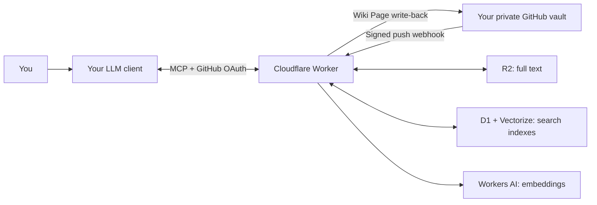

# Second Brain

A Markdown knowledge base maintained by your LLM, with a remote MCP service on
Cloudflare. Your private GitHub vault stores the curated pages; your AI client
captures sources, connects ideas, and answers questions using those pages.

**Start with [the cloud setup guide](docs/setup.md).** You need a GitHub account,
a Cloudflare account, and an AI client that supports remote MCP **write** tools.
You do not need a home server, Proxmox, Hermes, Obsidian, or the macOS app.
After the one-time technical setup, everyday use can happen entirely in your LLM.

> Credits: the Worker is based on the original work by
> [50R1Paps](https://github.com/50R1Paps) in
> [second-brain-worker](https://github.com/50R1Paps/second-brain-worker).
> See [component provenance](docs/provenance.md) for the imported sources and adaptations.

## How it works



The client LLM performs synthesis. The Worker stores and retrieves text; it does
not run a background curator or generate answers on your behalf. A Wiki Page
normally writes back to GitHub. An `ingested` file lives in Cloudflare only.

## Read in this order

1. [Architecture](docs/architecture.md): the method, data flow, and guarantees.
2. [Set up your instance](docs/setup.md): resources, OAuth, vault, webhook, bootstrap.
3. [Connect a client](docs/clients.md): Claude, ChatGPT, Codex, and other MCP clients.
4. [LLM instructions](docs/llm-instructions.md): copy into your client's persistent instructions.
5. [Operations](docs/operations.md): errors, credentials, costs, privacy, and recovery.

For developers: [API compatibility](docs/api.md), [validation](docs/validation.md),
[backlog](BACKLOG.md), and [provenance](docs/provenance.md).

## Optional modules

| Module | Purpose | Needs an always-on machine? |
| --- | --- | --- |
| [Hermes](integrations/hermes/README.md) | Local editing, autosync, optional review prompts | Only for scheduled local jobs |
| [Obsidian](integrations/obsidian/README.md) | Human editing of the same Markdown vault | No |
| [Siri](apps/siri/README.md) | Native macOS capture, search, and Spotlight | No server; a supported Mac is required |

## Develop without cloud resources

Node.js 22+:

```sh
npm ci
npm run typecheck
npm test
npm run check:distribution
npm run test:autosync
```

Worker tests use local Cloudflare emulators and synthetic data. Outbound network
requests are blocked unless explicitly mocked. There is no automated deployment
workflow and no production configuration in this repository.
Validation workflow templates are in [ci/](ci/README.md); enabling GitHub Actions
is a separate setup step. The prepared repository does not have active workflows.

`npm run dev` uses the isolated test configuration with fake credentials and
keyword-only retrieval. It is not a substitute for OAuth/cloud acceptance testing.

## Existing personal installations

This repository is a separate development source. Cloning, committing, or pushing
it does not upgrade an existing Worker, change a vault, or install anything on a
server. Existing installations stay on their current release until their owner
deliberately plans and performs an upgrade. See [the isolation boundary](docs/architecture.md#isolation-boundary).
For an explicitly requested migration, follow [the upgrade procedure](docs/upgrading.md).
